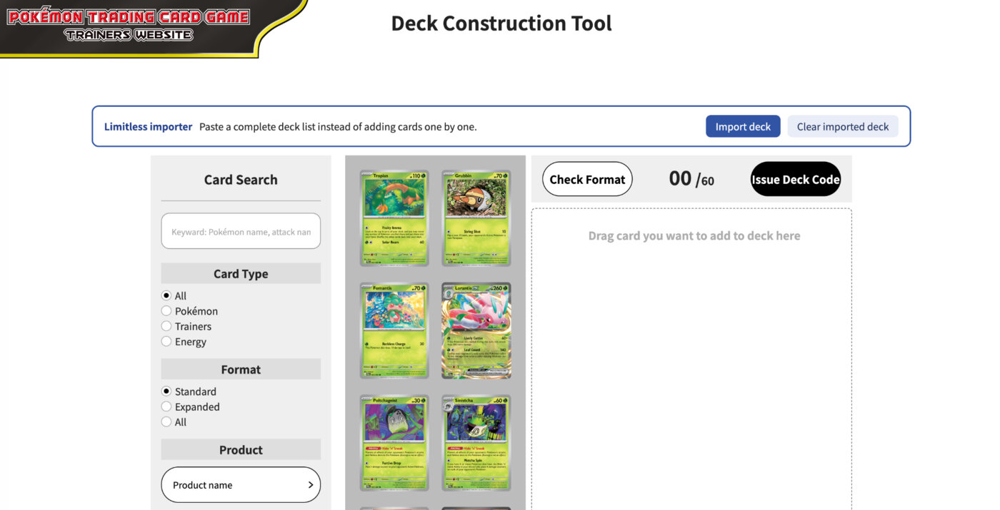
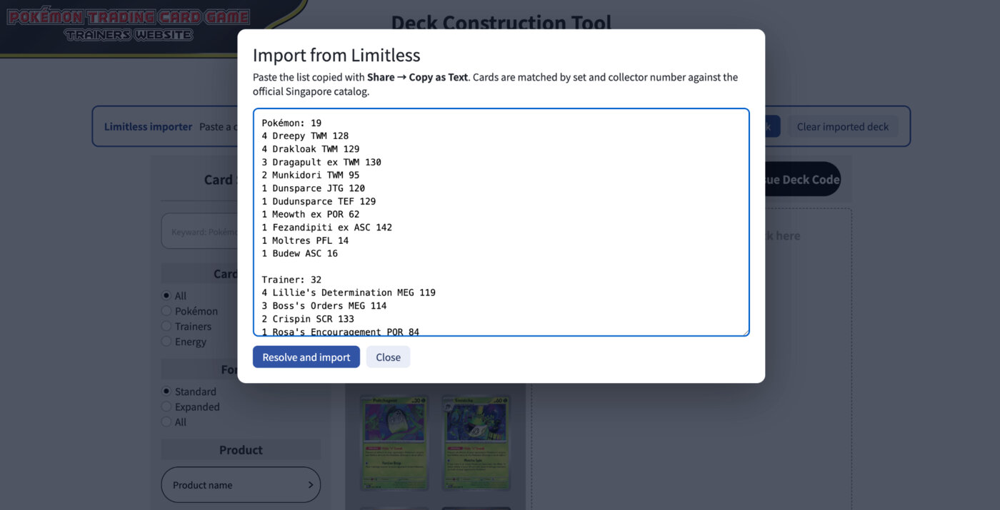
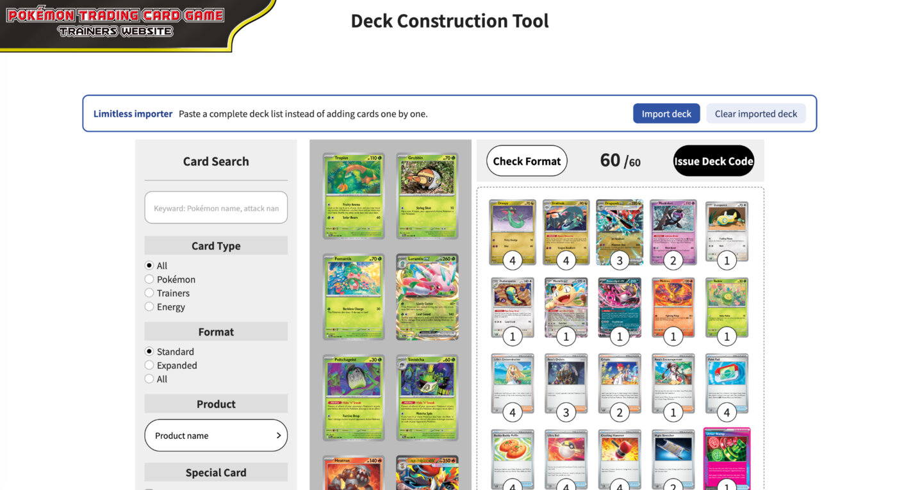

# Pokémon TCG Asia Deck Builder Assistant

A dependency-free userscript that adds one-click Limitless/PTCGL deck-list importing to the official [Pokémon TCG Asia Deck Construction Tool](https://asia.pokemon-card.com/).

Paste a complete deck list, let the assistant resolve each printing against the official regional catalog, review the card images, and continue with the website's normal format check and deck-code flow.

## What it looks like

The userscript adds an importer toolbar above the official deck builder:



Selecting **Import deck** opens the paste-and-resolve dialog. This example was captured on the Singapore website:



After resolution, the official builder contains all 60 cards and remains ready for **Check Format** and **Issue Deck Code**:



## Installation

### 1. Install Tampermonkey

Install [Tampermonkey](https://www.tampermonkey.net/) for Chrome, Edge, Firefox, Safari, or another supported browser. The instructions below use Chrome.

### 2. Allow user scripts in Chrome

Chrome may install Tampermonkey while still preventing userscripts from running.

1. Open `chrome://extensions`.
2. Enable **Developer mode** in the top-right corner.
3. Open **Details** for Tampermonkey.
4. Enable **Allow user scripts**.

If the importer bar does not appear, verify this setting first and then reload the Pokémon deck-builder page.

### 3. Install this userscript

1. Open the [userscript installation link](https://raw.githubusercontent.com/dgallitelli/asia-pokemon-card-deck-builder-assistant/main/limitless-to-trainers.user.js).
2. Tampermonkey should open an installation screen.
3. Select **Install**.
4. Open or reload the Deck Construction Tool for your Pokémon Asia region.

You should now see a **Limitless importer** bar above the official builder.

## Usage

1. On Limitless, use **Share → Copy as Text**, or copy a compatible PTCGL-style deck list.
2. Open the official Pokémon TCG Asia Deck Construction Tool.
3. Select **Import deck**.
4. Paste the list and select **Resolve and import**.
5. Review every resolved card image and any warnings.
6. Use the official **Check Format** and **Issue Deck Code** buttons.

Example input:

```text
Pokémon: 3
2 Fezandipiti ex ASC 142
1 Moltres PFL 14

Trainer: 2
2 Ultra Ball ASC 213

Energy: 2
2 Prism Energy ASC 216
```

## Features

- Imports a complete Limitless/PTCGL text list instead of selecting cards one by one.
- Matches cards by set code and collector number against the official regional catalog.
- Supports quantities and merges duplicate printings.
- Restores Enter-to-search in the official card search field.
- Keeps the official **Check Format** and **Issue Deck Code** workflow.
- Uses only same-origin requests to `asia.pokemon-card.com`; no tracking or third-party API.

## Region test status

The Singapore result is a manual in-browser test. Malaysia and the Philippines are checked by the [live region workflow](https://github.com/dgallitelli/asia-pokemon-card-deck-builder-assistant/actions/workflows/live-region-tests.yml), which loads the current official regional catalogs and resolves the complete 60-card fixture. An automated catalog-resolution check is not presented as equivalent to a visual browser test.

| Region | URL code | Catalog mode | Last tested | Result |
| --- | --- | --- | --- | --- |
| Singapore | `sg` | International English | 4 September 2026 | ✅ Manual 60-card browser import |
| Malaysia | `my` | International English | 4 September 2026 | ✅ Automated live 60-card resolution |
| Philippines | `ph` | International English | 4 September 2026 | ✅ Automated live 60-card resolution |
| Hong Kong (English) | `hk-en` | International English | — | ⬜ Not tested yet |
| Hong Kong | `hk` | Localized/native products | — | ⬜ Not tested; experimental |
| Taiwan | `tw` | Localized/native products | — | ⬜ Not tested; experimental |
| Thailand | `th` | Localized/native products | 4 September 2026 | ❌ English set codes cannot be resolved ([#1](https://github.com/dgallitelli/asia-pokemon-card-deck-builder-assistant/issues/1)) |
| Indonesia | `id` | Localized/native products | — | ⬜ Not tested; experimental |

Singapore, Malaysia, the Philippines, and Hong Kong English use the international-English mapping implemented by the script. The localized markets have different products, set composition, card names, and sometimes numbering. The assistant can detect product codes exposed by each regional builder, but it does not translate an English Limitless list into an equivalent localized release. Always review the resolved images before issuing a deck code.

When you test another region, please open an issue or pull request with the region, date, browser, userscript-manager version, pasted deck list, and result.

## Important behavior

The official editor stores private JavaScript counters that an external userscript cannot safely update. After an import, native drag-and-drop/card-result additions are blocked to avoid a mismatch between the displayed deck and the issued deck code. Edit the pasted list and import again to replace cards; click an imported card to change only its quantity.

## Development

The project has no runtime dependencies. Node.js 18 or newer is enough to run the checks:

```bash
npm test
npm run check
```

The unit suite includes the complete 60-card deck used for the first Singapore test and checks localized product-code detection. The separate live workflow verifies Malaysia and the Philippines against their current official catalogs. It deliberately stops before the website's **Check Format** endpoint because that separate feature depends on browser-managed editor state.

Contributions are welcome. When adding a set alias, map the Limitless code to the exact product value used by the official English Asia builder and include a test.

## Disclaimer

This is an unofficial community project. It is not affiliated with, endorsed, sponsored, or specifically approved by The Pokémon Company, Pokémon, Nintendo, Creatures, or GAME FREAK. Pokémon names and imagery belong to their respective owners.

## License

[MIT](LICENSE)
